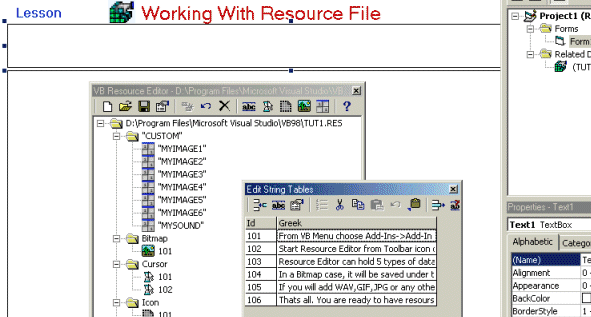

<div align="center">

## Working With Resource File \-\(\.res\)


</div>

### Description

Working With Resource File "Fast Tutorial & good sourse".
 
### More Info
 


<span>             |<span>
---                |---
**Submitted On**   |1999-01-08 04:43:16
**By**             |[Megalos](https://github.com/Planet-Source-Code/PSCIndex/blob/master/ByAuthor/megalos.md)
**Level**          |Intermediate
**User Rating**    |4.0 (12 globes from 3 users)
**Compatibility**  |VB 5\.0, VB 6\.0
**Category**       |[Miscellaneous](https://github.com/Planet-Source-Code/PSCIndex/blob/master/ByCategory/miscellaneous__1-1.md)
**World**          |[Visual Basic](https://github.com/Planet-Source-Code/PSCIndex/blob/master/ByWorld/visual-basic.md)
**Archive File**   |[CODE\_UPLOAD1315212292000\.zip](https://github.com/Planet-Source-Code/megalos-working-with-resource-file-res__1-13938/archive/master.zip)


### Source Code

```
Here are all types for the Resourse files.
Add any type of data like gifs and wavs on a ".res" file with the Vbasic Resourse editor EASY.
Download the sourse and you will have the tutoria l too.
Have a nice day
Article&code by Megalos from Cyprus
```

